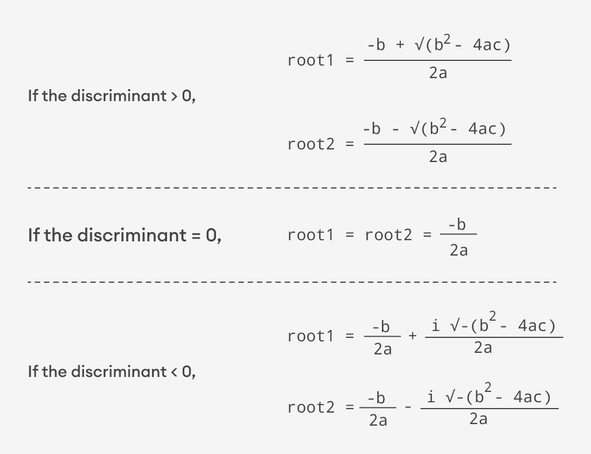

# JavaScript Examples and Solutions

Create a HTML file and link the js file you want to test you your html

## Table of Content

- [JavaScript Examples and Solutions](#javascript-examples-and-solutions)
  - [Table of Content](#table-of-content)
    - [Example 1 - Print Hello World](#example-1---print-hello-world)
    - [Example 2 - Add Two Numbers](#example-2---add-two-numbers)
    - [Example 3 - Find the square root of a number](#example-3---find-the-square-root-of-a-number)
    - [Example 4 - Calculate the area of a traingle](#example-4---calculate-the-area-of-a-traingle)
    - [Example 5 - Swap two variables](#example-5---swap-two-variables)
    - [Example 6 - Solve Quadratic Equation](#example-6---solve-quadratic-equation)
    - [Example 7 - Converting Kilometers to Miles](#example-7---converting-kilometers-to-miles)
    - [Example 8 - Convert Celsius to Fahrenheit](#example-8---convert-celsius-to-fahrenheit)


### Example 1 - Print Hello World
Print Hello World

[helloworld.js](examples/helloworld.js)

```js

// Print Hello World on Console
console.log("Hello World");

// Alert Hello World on browser
alert("Hello World");

// Print Hello World on browser
document.write("Hello World");

// Print Hello World in a html section with id "content"
document.getElementById("#content").innerHTML = "Hello World";

```


### Example 2 - Add Two Numbers
Add Two Numbers

[add2numbers.js](examples/add2numbers.js)

``` js
// Add two numbers
const firsNumber = 20;
const secondNumber = 45;

console.log(firsNumber +  secondNumber);

// Using template literals to log on console.

const sum = firsNumber + secondNumber;
console.log(`The sum of ${firsNumber} and ${secondNumber} is ${sum}`);


// Add two numbers entered by the user
const thirdNumber = parseInt(prompt("Enter the first number"));
const fourthNumber = parseInt(prompt("Enter the second Number"));

console.log(thirdNumber + fourthNumber);
```


### Example 3 - Find the square root of a number
Find the square root of a number

[sqrtofnumber.js](examples/sqrtofnumber.js)

```js

const number = prompt("Type the number");

// Using the built in Math.sqrt() method
const squareRoot = Math.sqrt(number);

console.log(`The square root of ${number} is ${squareRoot}`);

```


### Example 4 - Calculate the area of a traingle
Calculate the area of a traingle

[areaoftraingle.js](examples/areaoftraingle.js)

```js

/**
 * Formula for area of traingle where base and height is known
 * area = (base * height) / 2
 */

const base = 5;
const height = 15;

const area = (base * height) / 2;

console.log(`The area of a traingle with base ${base} and height ${height} is ${area}`);


/**
 * Formula for area of traingle where all sides are known using Heron's method
 * semi-perimeter = (side1 + side2 + side3) / 2
 * area = √(s(s-a)*(s-b)*(s-c))
 */

const sideOne = 10;
const sideTwo = 13;
const sideThree = 15;

// Value of the Semi Perimeter
const s = (sideOne + sideTwo + sideThree) / 2;

const innerCalculation = s * (s - sideOne) * (s - sideTwo) * (s - sideThree);

const areaOfTraingle = Math.sqrt(innerCalculation);

console.log(`The area of traingle with sides ${sideOne}, ${sideTwo}, ${sideThree} is ${areaOfTraingle}`);

```


### Example 5 - Swap two variables
Swap two variables

[swap2variables.js](examples/swap2variables.js)

```js

/** Using a Temporal variable */
let a = 5;
let b = 6;

// create a temporary variable
let temp;

// Swap
temp = a;
a = b;
b = temp;

console.log(`The value of a after swapping is ${a}`);
console.log(`The value of b after swapping is ${b}`);


/** Using Arithmetic operators */

let x = 4;
let y = 10;

x = x + y; // (4 + 10) = 14
y = x - y; // (14 - 10) = 4
x = x - y; // (14 - 4) = 10

console.log(`The value of x after swapping is ${x}`);
console.log(`The value of y after swapping is ${y}`);

```


### Example 6 - Solve Quadratic Equation
Solve Quadratic Equation
 
[quadratic.js](examples/quadratic.js)



```js
/**
 * Research Info
 * 
 * Finding the roots of a quadratic equation of known coefficients
 * 
 * Standard form of quadratic equation is
 * ax^2 + bx + c, where a, b and c are real numbers and a is not equal to 0
 * 
 * To find the roots of a quadratic equation we use the formula
 * (root1, root2) = (-b ± √(b^2-4ac)/2
 * 
 * The expression b^2-4ac is known as the discriminant of a quadratic equation
 * 
 * 1) if the discriminant > 0 the roots are real and different
 * 2) if the discriminant = 0 the roots are real and equal
 * 3) if the discriminant < 0 the roots are complex and different
 */


let root1, root2;

// Values of equation (ax^2 + bx + c)
let a = 2;
let b = 3;
let c = 5;

// Calculate discriminant

let discriminant = square(b) - 4 * a * c;

// Check for the root conditions

// Real and different roots
if(discriminant > 0){

    root1 = (-b + Math.sqrt(discriminant) / (2 * a));
    root2 = (-b - Math.sqrt(discriminant) / (2 * a));

    console.log(`The roots of the quadratic equation are ${root1} and ${root2}`);
}

// Real and equal roots
else if(discriminant == 0){

    root1 = root2 = -b / (2 * a);
    console.log(`The roots of the quadratic equation are ${root1}, ${root2}`);
}

// Complex roots
else{

    let realPart = (-b / (2 * a)).toFixed(2);
    let complexPart = (Math.sqrt(-discriminant) / (2 * a)).toFixed(2);

    console.log(`The roots of the quadratic equation are ${realPart} + ${complexPart}i and ${realPart} - ${complexPart}i`);

}


/**
 * Square any given number
 */
function square(number){
    return number*number;
}
```


### Example 7 - Converting Kilometers to Miles
Converting kilometers to miles

[kmtomiles.js](examples/kmtomiles.js)

```js
/**
 * Research Info
 * 1km = 0.621371 miles
 */

const kilometers = 50;
const conversionRate = 0.621371;
const miles = kilometers * conversionRate;

console.log(`${kilometers} kilometers is equal to ${miles} miles`)

```


### Example 8 - Convert Celsius to Fahrenheit
Converting Celsius to Fahrenheit

[celsiustofahrenheit.js](examples/celsiustofahrenheit.js)

```js
/**
 * fahrenheit = (celsius * 9/5) + 32
*/

const celsius = 50;

const fahrenheit = (celsius * 1.8) * 32;

console.log(`${celsius} degree celsius is equal to ${fahrenheit} fahrenheit`);

```